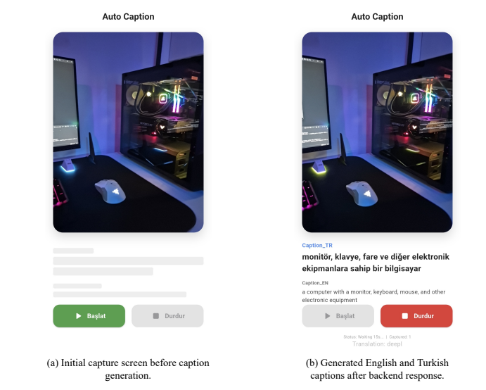
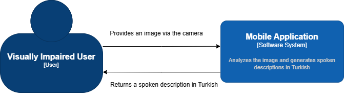
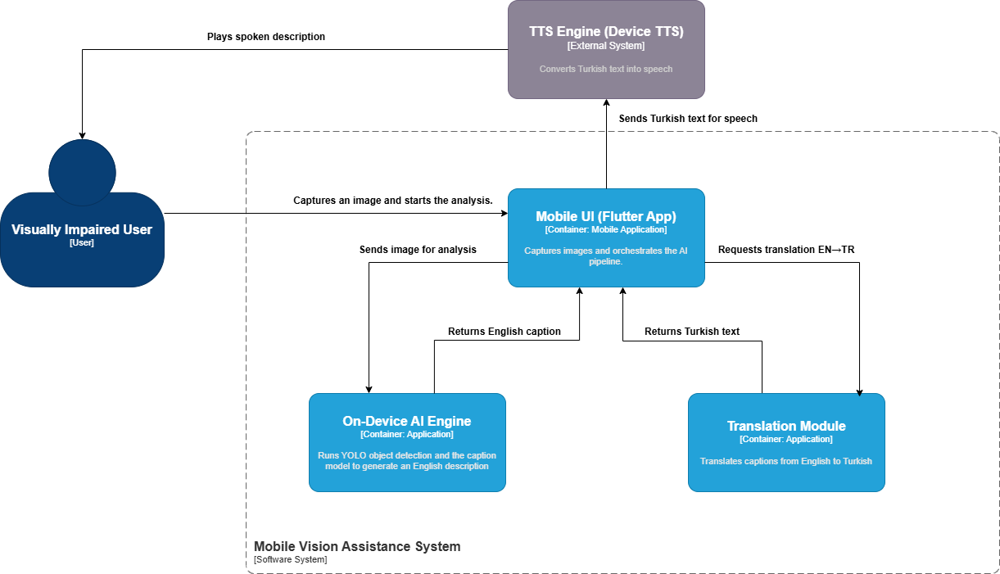
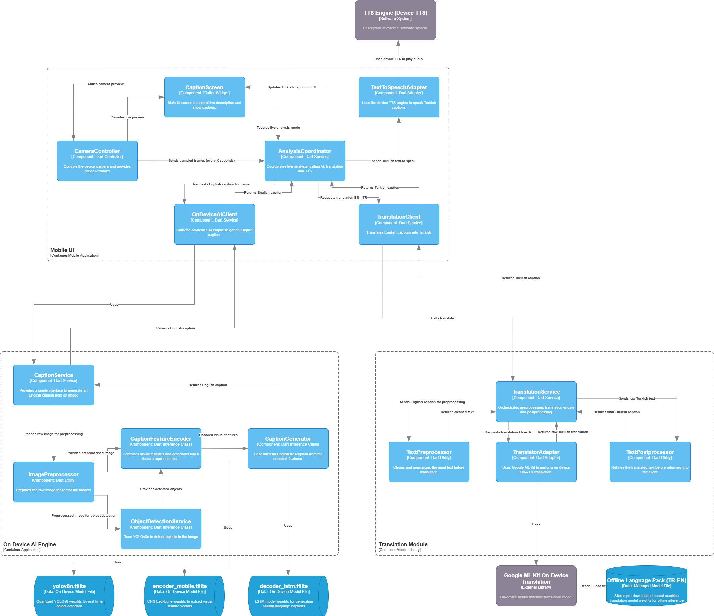
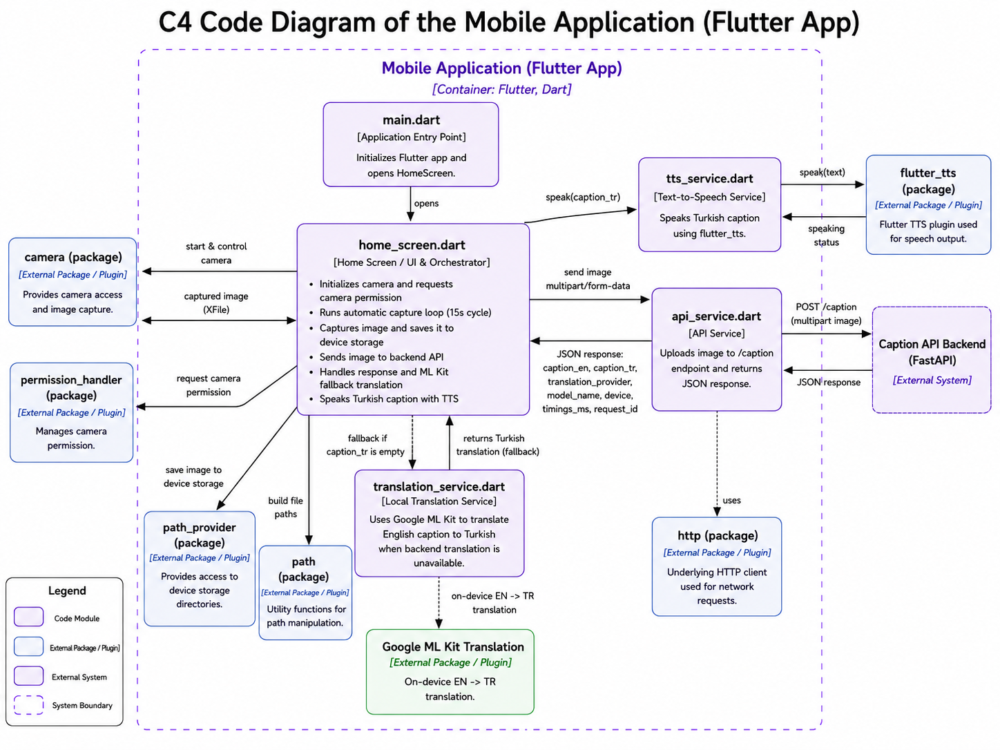
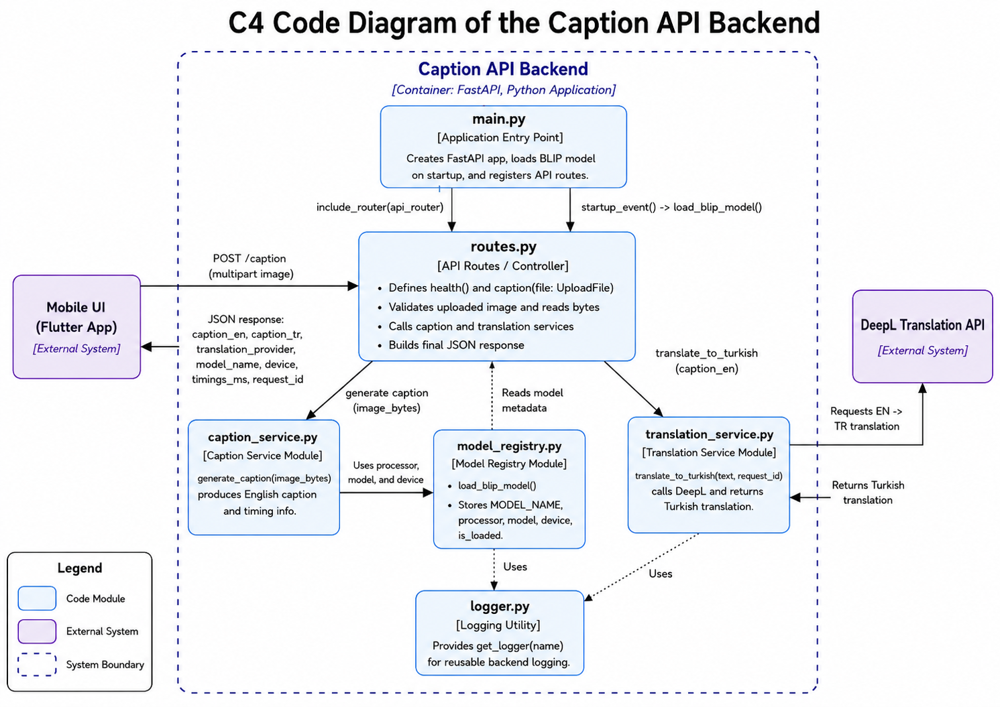

# AI-Based Image Captioning and Speech System for Visually Impaired Individuals

Görme engelli ve az gören kullanıcıların çevrelerindeki görsel içeriği daha kolay anlamasına yardımcı olmak amacıyla geliştirilen yapay zekâ tabanlı mobil görüntü açıklama ve seslendirme sistemi.

Sistem, mobil cihaz kamerasından alınan görüntüyü analiz eder, İngilizce bir sahne açıklaması üretir, açıklamayı Türkçeye çevirir ve kullanıcıya sesli olarak aktarır.

> Bu çalışma, Eskişehir Teknik Üniversitesi Bilgisayar Mühendisliği Bölümü BIM444 Bitirme Projesi kapsamında geliştirilmiştir.

---

## İçindekiler

- [Projenin Amacı](#projenin-amacı)
- [Temel Özellikler](#temel-özellikler)
- [Sistem Akışı](#sistem-akışı)
- [Kullanılan Teknolojiler](#kullanılan-teknolojiler)
- [Veri Seti ve Model](#veri-seti-ve-model)
- [Deneysel Sonuçlar](#deneysel-sonuçlar)
- [C4 Mimari Diyagramları](#c4-mimari-diyagramları)
- [Uygulama Görselleri](#uygulama-görselleri)
- [Proje Yapısı](#proje-yapısı)
- [Kurulum](#kurulum)
- [Çalıştırma](#çalıştırma)
- [API Kullanımı](#api-kullanımı)
- [Mobil Uygulama Bağlantı Ayarı](#mobil-uygulama-bağlantı-ayarı)
- [Hata Yönetimi ve Fallback Mekanizması](#hata-yönetimi-ve-fallback-mekanizması)
- [Bilinen Sınırlamalar](#bilinen-sınırlamalar)
- [Gelecek Çalışmalar](#gelecek-çalışmalar)
- [Proje Ekibi](#proje-ekibi)

---

## Projenin Amacı

Geleneksel nesne tanıma sistemleri çoğunlukla yalnızca görüntüde bulunan nesnelerin adlarını verir. Ancak görme engelli kullanıcılar için bir nesnenin adından daha fazlası gerekir.

Örneğin yalnızca `chair` ifadesi sınırlı bilgi sunarken, `a chair near a table in a room` ifadesi sahnenin bağlamını daha iyi açıklar.

Bu proje aşağıdaki hedeflere odaklanır:

- Görüntüdeki yalnızca nesneleri değil, genel sahne bağlamını açıklamak
- Üretilen İngilizce açıklamayı Türkçeye çevirmek
- Türkçe açıklamayı sesli olarak kullanıcıya aktarmak
- Gerçek kullanım koşullarına yakın görüntüler üzerinde çalışan erişilebilir bir prototip oluşturmak

---

### Örnek Sistem Çıktısı

Bir test görüntüsü ile üretilen İngilizce caption ve Türkçe çeviri örneği.



---

## Temel Özellikler

- Flutter tabanlı mobil uygulama
- Mobil kamera üzerinden görüntü yakalama
- Belirli aralıklarla otomatik görüntü işleme döngüsü
- FastAPI tabanlı backend servisi
- BLIP-Large tabanlı image captioning
- VizWiz veri seti üzerinde LoRA fine-tuning yaklaşımı
- Bellek kullanımını azaltmak için 8-bit model yükleme
- DeepL API ile İngilizce-Türkçe çeviri
- DeepL başarısız olduğunda Google ML Kit fallback çevirisi
- Flutter TTS ile Türkçe sesli çıktı
- İngilizce ve Türkçe caption gösterimi
- İstek kimliği, cihaz, model ve işlem süresi bilgileri içeren JSON yanıtı
- CUDA destekli GPU veya CPU üzerinde inference

---

## Sistem Akışı

```text
Kullanıcı
   │
   ▼
Flutter mobil uygulama kameradan görüntü alır
   │
   ▼
Görüntü POST /caption isteği ile FastAPI backend'e gönderilir
   │
   ▼
BLIP-Large görüntü için İngilizce açıklama üretir
   │
   ▼
DeepL API açıklamayı Türkçeye çevirir
   │
   ├── DeepL başarılıysa: Türkçe sonuç doğrudan kullanılır
   │
   └── DeepL başarısızsa: Mobil tarafta Google ML Kit çalışır
   │
   ▼
Türkçe açıklama mobil uygulamada gösterilir
   │
   ▼
Flutter TTS açıklamayı kullanıcıya sesli olarak okur
```

Varsayılan otomatik görüntü yakalama aralığı:

```text
15 saniye
```

---

## Kullanılan Teknolojiler

### Backend

| Teknoloji | Kullanım amacı |
|---|---|
| Python | Backend ve model inference geliştirme dili |
| FastAPI | REST API servisi |
| Uvicorn | ASGI sunucusu |
| PyTorch | Model çalıştırma altyapısı |
| Transformers | BLIP processor ve model yükleme |
| PEFT / LoRA | Parametre verimli fine-tuning |
| BitsAndBytes | 8-bit model yükleme ve bellek optimizasyonu |
| Pillow | Görüntü okuma ve RGB dönüşümü |
| HTTPX | DeepL API istekleri |
| python-dotenv | Ortam değişkenlerini yükleme |

### Mobile

| Teknoloji | Kullanım amacı |
|---|---|
| Flutter / Dart | Mobil uygulama geliştirme |
| camera | Kamera görüntüsü yakalama |
| http | Backend API iletişimi |
| google_mlkit_translation | Cihaz üzerinde fallback çeviri |
| flutter_tts | Türkçe text-to-speech |
| permission_handler | Kamera izni yönetimi |
| path_provider | Yakalanan görüntülerin saklanması |

### Harici Servis

| Servis | Kullanım amacı |
|---|---|
| DeepL API | İngilizce caption metnini Türkçeye çevirme |

---

## Veri Seti ve Model

### VizWiz Image Captioning Dataset

VizWiz, kör veya görme engelli kullanıcılar tarafından çekilmiş gerçek dünya görüntülerini ve bu görüntülere ait insan tarafından yazılmış açıklamaları içerir.

Veri setinin projede kullanılan bölümü:

| Veri bölümü | Adet |
|---|---:|
| Eğitim kaynak görüntüsü | 23.431 |
| Eğitim image-caption çifti | 117.155 |
| Validation görüntüsü | 7.750 |

VizWiz görüntüleri aşağıdaki zorlayıcı koşulları içerebilir:

- Bulanıklık
- Düşük ışık
- Hatalı veya eksik kadraj
- Alışılmadık kamera açıları
- Kısmen görünür nesneler
- Belirsiz sahne içeriği

Bu özellikler, veri setini erişilebilirlik odaklı image captioning için uygun hâle getirir.

### Model Yapılandırması

| Parametre | Değer |
|---|---|
| Base model | `Salesforce/blip-image-captioning-large` |
| Fine-tuning yöntemi | LoRA |
| Quantization | 8-bit loading |
| LoRA rank | 16 |
| LoRA alpha | 32 |
| LoRA dropout | 0.05 |
| Target modules | `query`, `value` |
| Optimizer | `paged_adamw_8bit` |
| Learning rate | `5e-5` |
| Per-device batch size | 2 |
| Gradient accumulation | 4 |
| Effective batch size | 8 |
| Training precision | FP16 |
| Maximum text length | 64 |
| Training GPU | NVIDIA RTX 3070, 8 GB VRAM |
| Seçilen checkpoint | `checkpoint-43935` |

> **Model dosyası notu:** Fine-tuned LoRA adapter ağırlıkları büyük olabileceği için Git deposuna doğrudan eklenmemelidir. Adapter dosyaları ayrı bir release, model deposu veya harici indirme bağlantısı üzerinden sağlanabilir.

> **Kod uyumluluğu notu:** `model_registry.py` yalnızca `Salesforce/blip-image-captioning-large` modelini yüklüyorsa uygulama base modeli çalıştırır. Fine-tuned sonucu kullanmak için seçilen LoRA adapter'ın `PEFT` üzerinden ayrıca yüklenmesi gerekir.

---

## Deneysel Sonuçlar

Base BLIP-Large modeli ile fine-tuned checkpoint'ler aynı VizWiz validation seti üzerinde değerlendirilmiştir.

Seçilen final model `checkpoint-43935` olmuştur.

| Metrik | Base BLIP-Large | Final model | İyileşme |
|---|---:|---:|---:|
| BLEU-1 | 56.83 | 71.32 | +14.49 |
| BLEU-2 | 39.18 | 54.74 | +15.56 |
| BLEU-3 | 26.29 | 41.77 | +15.48 |
| BLEU-4 | 17.16 | 32.47 | +15.31 |
| METEOR | 19.15 | 31.14 | +11.99 |
| ROUGE-L | 40.21 | 54.35 | +14.14 |
| CIDEr | 0.4801 | 1.2740 | +0.7939 |

CIDEr skorunun `0.4801` değerinden `1.2740` değerine yükselmesi, fine-tuning işleminin insan tarafından yazılmış referans caption'larla uyumu belirgin biçimde artırdığını göstermektedir.

Validation performansı üçüncü epoch'ta en yüksek değere ulaşmış, sonraki epoch'larda training loss azalmaya devam etmesine rağmen validation sonuçları gerilemiştir. Bu nedenle final model son epoch yerine en iyi validation checkpoint'ine göre seçilmiştir.


## C4 Mimari Diyagramları

Bu bölüm, sistemin farklı soyutlama seviyelerindeki C4 diyagramlarını göstermek için hazırlanmıştır.

Önerilen klasör yapısı:

```text
docs/
└── diagrams/
    ├── c1-context.png
    ├── c2-container.png
    ├── c3-component.png
    ├── c4-mobile.png
    └── c4-backend.png
```

### C1 — System Context Diagram

Sistemin görme engelli kullanıcı ile olan temel etkileşimini gösterir.




### C2 — Container Diagram

Flutter mobil uygulama, FastAPI backend, DeepL API ve TTS bileşenleri arasındaki iletişimi gösterir.




### C3 — Component Diagram

Mobil uygulama ve backend servisindeki ana bileşenleri, servisleri ve dış bağımlılıkları gösterir.




### C4 — Mobile Application Diagram

Kamera yakalama, API isteği, fallback çeviri ve TTS akışının mobil uygulama kodundaki karşılığını gösterir.




### C4 — Backend Service Diagram

API route, caption service, model registry, translation service ve logger bileşenleri arasındaki kod seviyesindeki akışı gösterir.




## Proje Yapısı

```text
bitirme-tezi/
├── backend/
│   ├── app/
│   │   ├── api/
│   │   │   └── routes.py
│   │   ├── core/
│   │   │   └── model_registry.py
│   │   ├── services/
│   │   │   ├── caption_service.py
│   │   │   └── translation_service.py
│   │   ├── utils/
│   │   │   └── logger.py
│   │   └── main.py
│   ├── requirements.txt
│   ├── .env.example
│   └── .gitignore
│
├── mobile/
│   ├── lib/
│   │   ├── screens/
│   │   │   └── home_screen.dart
│   │   ├── services/
│   │   │   ├── api_service.dart
│   │   │   ├── translation_service.dart
│   │   │   └── tts_service.dart
│   │   └── main.dart
│   ├── pubspec.yaml
│   └── android/
│
├── docs/
│   ├── diagrams/
│   │   ├── c1-context.png
│   │   ├── c2-container.png
│   │   ├── c3-component.png
│   │   ├── c4-mobile.png
│   │   └── c4-backend.png
│  
└── README.md
```

---

## Kurulum

### Gereksinimler

#### Backend

- Python 3.11 önerilir
- `pip`
- `venv` veya `virtualenv`
- CUDA destekli GPU önerilir, ancak CPU ile de çalışabilir
- İlk model indirmesi için internet bağlantısı
- DeepL çevirisi için internet bağlantısı ve API anahtarı

#### Mobile

- Flutter SDK
- Dart SDK
- Android Studio
- Android Emulator veya fiziksel Android cihaz
- Kamera izni
- Backend'e ağ erişimi

### 1. Projeyi Klonlama

```bash
git clone <REPOSITORY_URL>
cd bitirme-tezi
```

### 2. Backend Sanal Ortamı

Windows:

```cmd
cd backend
python -m venv .venv
.venv\Scripts\activate
pip install -r requirements.txt
```

Linux / macOS:

```bash
cd backend
python3 -m venv .venv
source .venv/bin/activate
pip install -r requirements.txt
```

Fine-tuned LoRA adapter kullanılacaksa aşağıdaki paketlerin de requirements içinde bulunması gerekir:

```text
peft
accelerate
bitsandbytes
```

### 3. DeepL Ortam Değişkenleri

`backend/.env` dosyasını oluşturun:

```env
DEEPL_API_KEY=YOUR_DEEPL_API_KEY
DEEPL_API_URL=https://api-free.deepl.com/v2/translate
```

Önerilen `.gitignore` içeriği:

```gitignore
.env
backend/.env
.venv/
backend/.venv/
__pycache__/
*.pyc
.dart_tool/
build/
```

API anahtarlarını hiçbir zaman Git deposuna göndermeyin.

### 4. Flutter Paketleri

```bash
cd mobile
flutter pub get
flutter devices
```

---

## Çalıştırma

### 1. Backend Servisini Başlatma

Windows:

```cmd
cd backend
.venv\Scripts\activate
uvicorn app.main:app --host 0.0.0.0 --port 8000 --reload
```

Linux / macOS:

```bash
cd backend
source .venv/bin/activate
uvicorn app.main:app --host 0.0.0.0 --port 8000 --reload
```

Başarılı başlangıçta benzer bir çıktı görülür:

```text
Model loading completed
Application startup complete.
Uvicorn running on http://0.0.0.0:8000
```

### 2. Backend Sağlık Kontrolü

Tarayıcı veya API istemcisi ile:

```text
http://127.0.0.1:8000/health
```

Swagger arayüzü:

```text
http://127.0.0.1:8000/docs
```

### 3. Mobil Uygulamayı Başlatma

Yeni bir terminal açın:

```bash
cd mobile
flutter run
```

Uygulama açıldıktan sonra kamera iznini verin ve `Başlat` butonuna basın.

---

## API Kullanımı

### `GET /health`

Modelin yüklenme durumunu ve kullanılan cihazı döndürür.

Örnek yanıt:

```json
{
  "status": "ok program çalisiyor",
  "service": "Caption Servisi",
  "model_name": "Salesforce/blip-image-captioning-large",
  "device": "cuda",
  "loaded": true
}
```

### `POST /caption`

Bir görüntü dosyasını `multipart/form-data` biçiminde kabul eder.

Form alanı:

```text
file: image/jpeg veya image/png
```

Örnek `curl` isteği:

```bash
curl -X POST "http://127.0.0.1:8000/caption" \
  -H "accept: application/json" \
  -H "Content-Type: multipart/form-data" \
  -F "file=@sample.jpg;type=image/jpeg"
```

Örnek başarılı yanıt:

```json
{
  "caption_en": "a computer desk with a monitor, keyboard and mouse",
  "caption_tr": "monitör, klavye ve fare bulunan bir bilgisayar masası",
  "translation_provider": "deepl",
  "model_name": "Salesforce/blip-image-captioning-large",
  "device": "cuda",
  "timings_ms": {
    "read": 1,
    "preprocess": 24,
    "generate": 842,
    "translation": 213,
    "total": 1080
  },
  "request_id": "00000000-0000-0000-0000-000000000000"
}
```

Geçersiz dosya tipi gönderildiğinde:

```json
{
  "detail": "Invalid image file"
}
```

Caption üretiminde beklenmeyen hata oluştuğunda:

```json
{
  "detail": "Caption generation failed"
}
```

---

## Mobil Uygulama Bağlantı Ayarı

Android Emulator, bilgisayardaki `localhost` adresine doğrudan `127.0.0.1` üzerinden erişemez.

Bu nedenle Android Emulator için backend adresi:

```dart
static const String _baseUrl = 'http://10.0.2.2:8000';
```

Dosya:

```text
mobile/lib/services/api_service.dart
```

Fiziksel Android cihaz kullanılıyorsa bilgisayarın yerel IP adresi kullanılmalıdır:

```dart
static const String _baseUrl = 'http://192.168.1.25:8000';
```

Bu durumda:

- Telefon ve bilgisayar aynı yerel ağa bağlı olmalıdır.
- Bilgisayarın güvenlik duvarı 8000 portuna erişime izin vermelidir.
- Backend `--host 0.0.0.0` parametresiyle başlatılmalıdır.

---

## Hata Yönetimi ve Fallback Mekanizması

Çeviri önceliği:

```text
1. Backend DeepL API ile çeviri yapmayı dener.
2. DeepL başarılıysa caption_tr alanı mobil uygulamaya gönderilir.
3. DeepL başarısızsa veya caption_tr boşsa mobil uygulama ML Kit'i çalıştırır.
4. Türkçe metin elde edilirse Flutter TTS tarafından okunur.
5. Her iki çeviri yöntemi de başarısızsa kullanıcıya hata durumu gösterilir.
```

Backend tarafından dönebilecek çeviri durumları:

| Değer | Açıklama |
|---|---|
| `deepl` | DeepL çevirisi başarılı |
| `deepl_failed` | DeepL isteği başarısız |
| `deepl_not_configured` | API anahtarı tanımlı değil |
| `empty_text` | Çevrilecek caption boş |
| `mlkit_fallback` | Mobil ML Kit fallback kullanıldı |
| `translation_failed` | Çeviri tamamen başarısız |

---

## Bilinen Sınırlamalar

- Caption üretimi backend üzerinde çalıştığı için ağ bağlantısı gerekir.
- Çok karanlık, bulanık veya belirsiz görüntüler yanlış ya da yetersiz açıklama üretebilir.
- İngilizce caption hataları Türkçe çeviriye ve sesli çıktıya taşınabilir.
- Final değerlendirme resmi test seti yerine validation seti üzerinde yapılmıştır.
- Tam kapsamlı hyperparameter search, GPU süresi ve donanım sınırları nedeniyle uygulanmamıştır.
- Sistem henüz görme engelli kullanıcılarla geniş ölçekli kullanıcı testinden geçirilmemiştir.
- Model ağırlıkları ve LoRA adapter dosyaları depo boyutunu büyütebilir.

---

## Gelecek Çalışmalar

- Görme engelli kullanıcılarla kullanılabilirlik testleri
- Türkçe-native image captioning modeli geliştirme
- Caption ve çeviri kalitesini birlikte değerlendirme
- Backend gecikmesini azaltma
- Model quantization ve compression çalışmalarını geliştirme
- Mobil cihaz üzerinde doğrudan inference
- Kamera kadrajı ve görüntü kalitesi için sesli yönlendirme
- Düşük kaliteli görüntüler için güven skoru ve belirsizlik mesajı
- Offline çalışma seçenekleri
- Adapter ve model sürüm yönetimi

---

## Proje Ekibi

- Batuhan Günal
- Mehmet Çokol  (mehmetcokol0@gmail.com)
- Ahmet Dalkılıç

**Akademik Danışman:** Dr. Öğr. Üyesi Sema Candemir  
**Üniversite:** Eskişehir Teknik Üniversitesi  
**Bölüm:** Bilgisayar Mühendisliği  
**Proje Türü:** Bachelor of Science Project / BIM444  
**Tarih:** Mayıs 2026

---

## Akademik Kullanım Notu

Bu proje akademik amaçlı geliştirilmiş bir prototiptir. Sistem, gerçek kullanıcılar açısından faydalı bir yardımcı teknoloji yaklaşımı sunsa da güvenlik açısından kritik kararlar, bağımsız hareket veya tehlike algılama için tek başına kullanılmamalıdır.

Model çıktıları her zaman doğru olmayabilir. Üretilen açıklamalar, özellikle düşük kaliteli veya belirsiz görüntülerde kullanıcı tarafından dikkatle değerlendirilmelidir.
